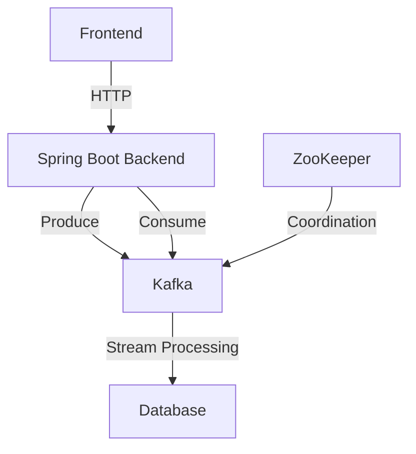
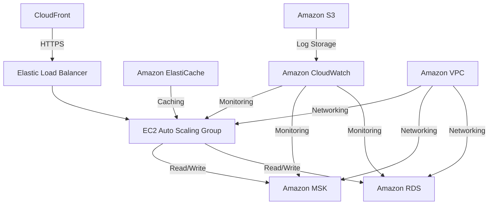

# Spring Kafka Demo - Architecture Document

## Table of Contents
1. [Application Overview](#application-overview)
2. [Local Development Architecture](#local-development-architecture)
3. [AWS Deployment Architecture](#aws-deployment-architecture)
4. [Data Flow](#data-flow)
5. [Components](#components)
6. [Security Considerations](#security-considerations)
7. [Scaling](#scaling)
8. [Monitoring and Logging](#monitoring-and-logging)

## Application Overview

This is a Spring Boot application with a React/Angular frontend that demonstrates event streaming using Apache Kafka. The application allows tracking various user events (like page views, searches, cart operations) and processes them in real-time.

## Local Development Architecture

### Components

1. **Frontend**
   - Built with Angular
   - Communicates with backend via REST API
   - Real-time updates via WebSocket or Server-Sent Events

2. **Backend (Spring Boot)**
   - REST API endpoints for frontend communication
   - Kafka producers for event publishing
   - Kafka consumers for event processing
   - Data persistence layer

3. **Apache Kafka**
   - Message broker for event streaming
   - Topics for different event types
   - Consumer groups for parallel processing

4. **Database**
   - Stores processed events and application data
   - Schema designed for both operational and analytical queries

5. **ZooKeeper**
   - Manages Kafka broker coordination
   - Handles leader election and configuration

## AWS Deployment Architecture

### AWS Services

1. **Compute**
   - **EC2 Auto Scaling Group**: Hosts the Spring Boot application
   - **Elastic Load Balancer**: Distributes traffic across EC2 instances

2. **Messaging**
   - **Amazon MSK (Managed Kafka)**: Fully managed Apache Kafka service
   - **SNS/SQS**: For decoupling components (if needed)

3. **Database**
   - **Amazon RDS**: For persistent data storage (PostgreSQL/MySQL)
   - **Amazon ElastiCache**: For caching (Redis/Memcached)

4. **Networking**
   - **VPC**: Isolated cloud resources
   - **Subnets**: Public and private subnets for security
   - **Security Groups**: Firewall rules for resources
   - **Route 53**: DNS management

5. **Storage**
   - **S3**: For static assets and logs
   - **EBS**: For EC2 instance storage

6. **Monitoring & Logging**
   - **CloudWatch**: Monitoring and alerting
   - **CloudTrail**: API activity logging
   - **X-Ray**: Distributed tracing

## Data Flow

1. **Event Generation**
   - User interacts with frontend
   - Frontend sends event to backend API
   - Backend validates and publishes event to Kafka

2. **Event Processing**
   - Kafka consumers process events in real-time
   - Business logic is applied to each event
   - Processed data is stored in the database

3. **Data Access**
   - Frontend queries backend for event data
   - Backend retrieves data from database/cache
   - Results are returned to frontend for display

## Security Considerations

1. **Authentication & Authorization**
   - JWT-based authentication
   - Role-based access control (RBAC)
   - AWS IAM for service-level permissions

2. **Network Security**
   - VPC with private subnets
   - Security groups and network ACLs
   - TLS/SSL for data in transit

3. **Data Protection**
   - Encryption at rest (EBS, RDS, S3)
   - Key management with AWS KMS
   - Data masking for sensitive information

## Scaling

1. **Horizontal Scaling**
   - Auto Scaling Groups for EC2 instances
   - Multiple Kafka brokers and partitions
   - Read replicas for the database

2. **Load Balancing**
   - Application Load Balancer for HTTP/HTTPS traffic
   - Kafka partition distribution

3. **Database Scaling**
   - Read replicas for read-heavy workloads
   - Sharding for very large datasets

## Monitoring and Logging

1. **Application Metrics**
   - Custom metrics via CloudWatch
   - JVM metrics for Spring Boot
   - Kafka consumer lag monitoring

2. **Logging**
   - Centralized logging with CloudWatch Logs
   - Structured logging with JSON format
   - Log rotation and retention policies

3. **Alerting**
   - CloudWatch Alarms for critical metrics
   - SNS notifications for incidents
   - Auto-recovery actions

## Deployment Pipeline

1. **CI/CD**
   - AWS CodePipeline for deployment automation
   - AWS CodeBuild for building artifacts
   - AWS CodeDeploy for deployments

2. **Infrastructure as Code**
   - AWS CloudFormation/Terraform for infrastructure
   - Version-controlled configuration
   - Environment parity with local development

## Cost Optimization

1. **Resource Sizing**
   - Right-sizing EC2 instances
   - Reserved Instances for predictable workloads
   - Spot Instances for non-critical workloads

2. **Storage Optimization**
   - Lifecycle policies for S3
   - Data archival strategies
   - Compression for stored data

## Disaster Recovery

1. **Backup Strategy**
   - Automated RDS snapshots
   - S3 versioning and cross-region replication
   - Regular backup testing

2. **High Availability**
   - Multi-AZ deployment for critical services
   - Cross-region replication for critical data
   - Automated failover procedures
