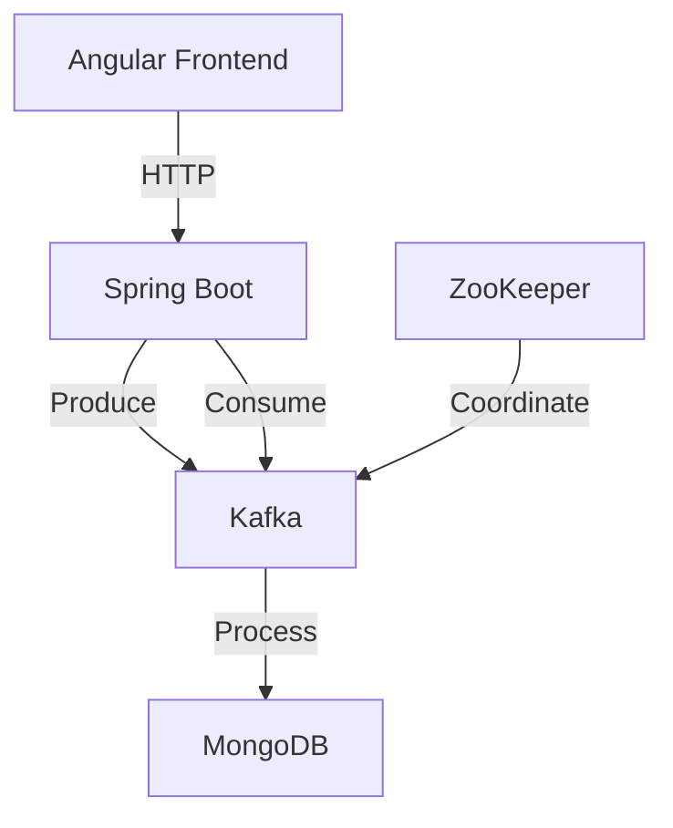
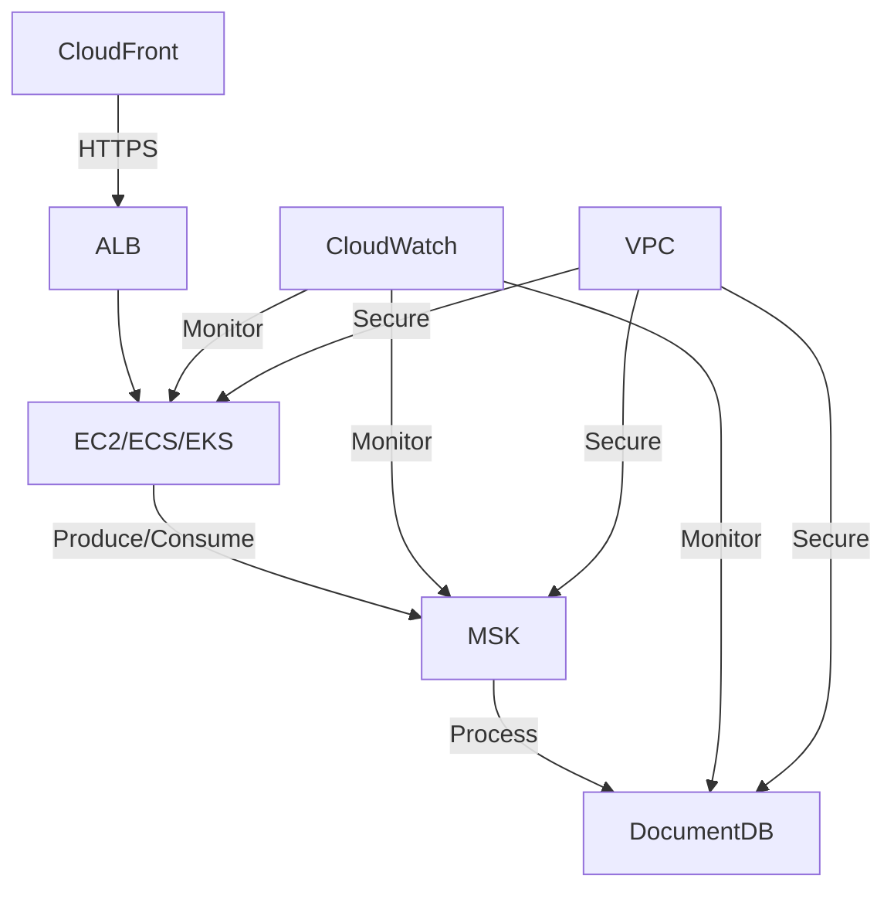

# Spring Kafka Demo - Architecture Document

## Table of Contents
1. [Application Overview](#application-overview)
2. [Local Development Architecture](#local-development-architecture)
3. [AWS Deployment Architecture](#aws-deployment-architecture)
4. [Data Flow](#data-flow)
5. [Components](#components)
6. [Security Considerations](#security-considerations)
7. [Scaling](#scaling)
8. [Monitoring and Logging](#monitoring-and-logging)

## Application Overview

This is a Spring Boot application with a React/Angular frontend that demonstrates event streaming using Apache Kafka. The application allows tracking various user events (like page views, searches, cart operations) and processes them in real-time.

## Local Development Architecture


### Components

1. **Frontend**
   - Built with Angular
   - Communicates with backend via REST API
   - Real-time updates via WebSocket or Server-Sent Events

2. **Backend (Spring Boot)**
   - REST API endpoints for frontend communication
   - Kafka producers for event publishing
   - Kafka consumers for event processing
   - Dual-write pattern for reliable persistence
   - Transaction management for data consistency
   - Retry mechanisms for failed database operations

3. **Apache Kafka**
   - Message broker for event streaming
   - Topics for different event types
   - Consumer groups for parallel processing

4. **Database**
   - Stores processed events and application data
   - Schema designed for both operational and analytical queries

5. **ZooKeeper**
   - Manages Kafka broker coordination
   - Handles leader election and configuration

## AWS Deployment Architecture


### AWS Services

1. **Compute**
   - **EC2 Auto Scaling Group**: Hosts the Spring Boot application

2. **Messaging**
   - **Amazon MSK (Managed Kafka)**: Fully managed Apache Kafka service
   - **SNS/SQS**: For decoupling components (if needed)

3. **Database**
   - **Amazon RDS/Aurora**: For persistent data storage with high availability
     - Multi-AZ deployment for fault tolerance
     - Read replicas for scaling read operations
     - Automated backups and point-in-time recovery
   - **Amazon ElastiCache**: For caching (Redis/Memcached)
   - **Data Retention Strategy**:
     - Hot data in RDS/Aurora
     - Warm data in S3 (via Kinesis Firehose)
     - Cold data in S3 Glacier for compliance/archival

4. **Networking**
   - **VPC**: Isolated cloud resources
   - **Subnets**: Public and private subnets for security
   - **Security Groups**: Firewall rules for resources

5. **Storage**
   - **S3**: For static assets and logs
   - **EBS**: For EC2 instance storage

6. **Monitoring & Logging**
   - **CloudWatch**: Monitoring and alerting
   - **CloudTrail**: API activity logging
   - **X-Ray**: Distributed tracing

## Data Flow

1. **Event Generation**
   - Frontend generates user interaction events
   - Events are sent to the backend via HTTP/HTTPS

2. **Event Ingestion**
   - Backend receives events via REST API
   - Events are validated and enriched
   - Events are published to Kafka topics

3. **Event Processing**
   - Kafka consumers process events asynchronously
   - Events are transformed and enriched if needed
   - Processed events are stored in MongoDB
   - Real-time analytics are updated

4. **Data Persistence**
   - Processed events are stored in MongoDB collections
   - Data is indexed for fast retrieval
   - Archival policies for old data

5. **Data Access**
   - REST APIs expose processed data to frontend
   - Real-time updates via WebSocket (if implemented)
   - Aggregated data for dashboards

## Components

### 1. Frontend (Angular)
- Built with Angular
- Material UI components
- Real-time updates via WebSocket/SSE
- Responsive design for all devices

### 2. Backend (Spring Boot)
- **API Layer**: REST controllers for HTTP requests
- **Service Layer**: Business logic and validation
- **Repository Layer**: MongoDB data access
- **Kafka Integration**:
  - Producers for publishing events
  - Consumers for processing events
  - Error handling and retries
  - Dead-letter queue for failed messages
- **MongoDB Integration**:
  - Document storage for events
  - Indexing for performance
  - Aggregation framework for analytics

### 3. Apache Kafka
- **Topics**:
  - `user-events`: Raw user interaction events
  - `processed-events`: Successfully processed events
  - `dead-letter-queue`: Failed events for investigation
- **Consumer Groups**:
  - `user-event-consumers`: Main event processing
  - `analytics-consumers`: Real-time analytics

### 4. MongoDB
- **Database**: `user-events`
- **Collections**:
  - `events`: Raw event data
  - `processed_events`: Processed and enriched events
  - `user_profiles`: User information
  - `analytics`: Aggregated metrics

### 5. Infrastructure
- **Docker**: Containerization
- **Docker Compose**: Local development
- **Monitoring**:
  - Spring Boot Actuator
  - Prometheus metrics
  - Grafana dashboards

## Deployment Architecture

### Local Development


### Production (AWS)


## Security Considerations

1. **Data Encryption**
   - TLS for all inter-service communication
   - Encrypted volumes for data at rest
   - Secrets management (AWS Secrets Manager/Parameter Store)

2. **Authentication & Authorization**
   - JWT for API authentication
   - Role-based access control (RBAC)
   - OAuth2/OIDC integration

3. **Network Security**
   - VPC with private subnets
   - Security groups and network ACLs
   - Web Application Firewall (WAF)

4. **Compliance**
   - GDPR/CCPA compliance
   - Audit logging
   - Data retention policies

## Scaling

### Horizontal Scaling
- **Application Layer**:
  - Multiple instances behind load balancer
  - Auto-scaling based on CPU/memory metrics
  - Stateless design for easy scaling

- **Kafka**:
  - Multiple partitions per topic
  - Consumer group rebalancing
  - Broker replication

- **MongoDB**:
  - Replica sets for high availability
  - Sharding for horizontal scaling
  - Read preferences for read scaling

### Performance Optimization
- **Caching**:
  - Redis/Memcached for frequently accessed data
  - Spring Cache abstraction
  - Cache invalidation strategies

- **Database Optimization**:
  - Proper indexing
  - Query optimization
  - Connection pooling

- **Kafka Optimization**:
  - Batch processing
  - Compression
  - Tuning producer/consumer configurations

## Monitoring and Alerting

### Metrics Collection
- **Application Metrics**:
  - JVM metrics
  - HTTP request metrics
  - Custom business metrics

- **Kafka Metrics**:
  - Consumer lag
  - Broker metrics
  - Topic metrics

- **MongoDB Metrics**:
  - Query performance
  - Connection statistics
  - Replication lag

### Logging
- Centralized logging (ELK stack)
- Structured logging with correlation IDs
- Log rotation and retention policies

### Alerting
- Threshold-based alerts
- Anomaly detection
- On-call rotations

## Disaster Recovery

### Backup Strategy
- **MongoDB**:
  - Regular backups to S3
  - Point-in-time recovery
  - Cross-region replication

- **Kafka**:
  - Topic replication
  - Log compaction
  - Message retention policies

### Failover Procedures
- Automated failover for MongoDB replica sets
- Kafka broker failover
- Multi-AZ deployment

## Future Enhancements

### Short-term
- [ ] Implement WebSocket for real-time updates
- [ ] Add more event types and processing logic
- [ ] Enhance monitoring and alerting

### Long-term
- [ ] Machine learning for event analysis
- [ ] Multi-region deployment
- [ ] Advanced analytics dashboard

## Conclusion

This architecture provides a robust foundation for building scalable, reliable, and maintainable event-driven applications. The use of Kafka for event streaming and MongoDB for flexible data storage allows for efficient processing of high-volume event data while maintaining data consistency and availability.

1. **Event Generation**
   - User interacts with frontend
   - Frontend sends event to backend API
   - Backend validates and publishes event to Kafka

2. **Event Processing**
   - Kafka consumers process events in real-time
   - Business logic is applied to each event
   - Events are processed in two parallel paths:
     - **Stream Processing Path**: Real-time processing and analytics
     - **Persistence Path**: Durable storage in the database

3. **Data Storage**
   - **Event Sourcing**: Raw events stored for full audit trail
   - **Materialized Views**: Processed data stored for efficient querying
   - **Caching Layer**: Frequently accessed data cached for performance

3. **Data Access**
   - Frontend queries backend for event data
   - Backend retrieves data from database/cache
   - Results are returned to frontend for display

## Security Considerations

1. **Authentication & Authorization**
   - JWT-based authentication
   - Role-based access control (RBAC)
   - AWS IAM for service-level permissions

2. **Network Security**
   - VPC with private subnets
   - Security groups and network ACLs
   - TLS/SSL for data in transit

3. **Data Protection**
   - Encryption at rest (EBS, RDS, S3)
   - Key management with AWS KMS
   - Data masking for sensitive information

## Scaling

1. **Horizontal Scaling**
   - Auto Scaling Groups for EC2 instances
   - Multiple Kafka brokers and partitions
   - Read replicas for the database

2. **Load Balancing**
   - Application Load Balancer for HTTP/HTTPS traffic
   - Kafka partition distribution

3. **Database Scaling**
   - Read replicas for read-heavy workloads
   - Sharding for very large datasets

## Implementation Details

### 1. Dual-Write Implementation

#### Spring Boot Configuration

```java
@Configuration
@EnableTransactionManagement
public class PersistenceConfig {
    
    @Bean
    public PlatformTransactionManager transactionManager(EntityManagerFactory emf) {
        JpaTransactionManager transactionManager = new JpaTransactionManager();
        transactionManager.setEntityManagerFactory(emf);
        return transactionManager;
    }
    
    @Bean
    public KafkaTemplate<String, Event> kafkaTemplate() {
        return new KafkaTemplate<>(producerFactory());
    }
    
    @Bean
    public ProducerFactory<String, Event> producerFactory() {
        Map<String, Object> configProps = new HashMap<>();
        configProps.put(ProducerConfig.BOOTSTRAP_SERVERS_CONFIG, "${spring.kafka.bootstrap-servers}");
        configProps.put(ProducerConfig.KEY_SERIALIZER_CLASS_CONFIG, StringSerializer.class);
        configProps.put(ProducerConfig.VALUE_SERIALIZER_CLASS_CONFIG, JsonSerializer.class);
        configProps.put(ProducerConfig.ACKS_CONFIG, "all");
        configProps.put(ProducerConfig.RETRIES_CONFIG, 3);
        configProps.put(ProducerConfig.ENABLE_IDEMPOTENCE_CONFIG, true);
        return new DefaultKafkaProducerFactory<>(configProps);
    }
}
```

#### Transactional Outbox Pattern

```java
@Service
@RequiredArgsConstructor
public class EventPublisherService {
    
    private final EventRepository eventRepository;
    private final ApplicationEventPublisher eventPublisher;
    
    @Transactional
    public void publishEvent(Event event) {
        // 1. Save to database first
        Event savedEvent = eventRepository.save(event);
        
        // 2. Publish domain event for Kafka
        eventPublisher.publishEvent(new EventPublishedEvent(savedEvent));
    }
}

@Component
@RequiredArgsConstructor
class EventPublisherListener {
    
    private final KafkaTemplate<String, Event> kafkaTemplate;
    
    @TransactionalEventListener(phase = TransactionPhase.AFTER_COMMIT)
    public void handleEventPublished(EventPublishedEvent event) {
        kafkaTemplate.send("user-events", event.getEvent().getId(), event.getEvent())
            .addCallback(
                result -> log.info("Event published to Kafka: {}", event.getEvent().getId()),
                ex -> log.error("Failed to publish event: {}", event.getEvent().getId(), ex)
            );
    }
}
```

### 2. Consumer Configuration

```java
@Configuration
public class KafkaConsumerConfig {

    @Value("${spring.kafka.bootstrap-servers}")
    private String bootstrapServers;

    @Bean
    public ConsumerFactory<String, Event> eventConsumerFactory() {
        Map<String, Object> props = new HashMap<>();
        props.put(ConsumerConfig.BOOTSTRAP_SERVERS_CONFIG, bootstrapServers);
        props.put(ConsumerConfig.GROUP_ID_CONFIG, "event-processor-group");
        props.put(ConsumerConfig.KEY_DESERIALIZER_CLASS_CONFIG, StringDeserializer.class);
        props.put(ConsumerConfig.VALUE_DESERIALIZER_CLASS_CONFIG, JsonDeserializer.class);
        props.put(JsonDeserializer.TRUSTED_PACKAGES, "com.example.kafkademo.events");
        
        // Exactly-once processing
        props.put(ConsumerConfig.ISOLATION_LEVEL_CONFIG, "read_committed");
        props.put(ConsumerConfig.ENABLE_AUTO_COMMIT_CONFIG, false);
        
        return new DefaultKafkaConsumerFactory<>(props);
    }

    @Bean
    public ConcurrentKafkaListenerContainerFactory<String, Event> kafkaListenerContainerFactory() {
        ConcurrentKafkaListenerContainerFactory<String, Event> factory = 
            new ConcurrentKafkaListenerContainerFactory<>();
        factory.setConsumerFactory(eventConsumerFactory());
        
        // Handle errors and retries
        factory.setErrorHandler(new SeekToCurrentErrorHandler(
            new DeadLetterPublishingRecoverer(
                new KafkaTemplate<>(producerFactory()),
                (record, exception) -> new TopicPartition("user-events.DLT", record.partition())
            ),
            new FixedBackOff(1000L, 3)
        ));
        
        return factory;
    }
}
```

### 3. Event Processing with Idempotency

```java
@Service
@RequiredArgsConstructor
public class EventProcessorService {
    
    private final EventRepository eventRepository;
    private final ProcessedEventRepository processedEventRepository;
    
    @KafkaListener(topics = "user-events", groupId = "event-processor-group")
    @Transactional
    public void processEvent(ConsumerRecord<String, Event> record, Acknowledgment ack) {
        String eventId = record.key();
        
        // Check for duplicate processing
        if (processedEventRepository.existsById(eventId)) {
            log.warn("Duplicate event detected: {}", eventId);
            ack.acknowledge();
            return;
        }
        
        try {
            // Process the event
            processEvent(record.value());
            
            // Mark as processed
            processedEventRepository.save(new ProcessedEvent(eventId, Instant.now()));
            
            // Commit the offset
            ack.acknowledge();
            
        } catch (Exception e) {
            log.error("Error processing event: {}", eventId, e);
            throw e; // Will trigger retry
        }
    }
    
    private void processEvent(Event event) {
        // Business logic here
    }
}
```

### 4. AWS-Specific Configuration

#### application-aws.yml

```yaml
spring:
  datasource:
    url: ${DB_URL}
    username: ${DB_USERNAME}
    password: ${DB_PASSWORD}
    hikari:
      maximum-pool-size: 10
      minimum-idle: 2
  
  jpa:
    properties:
      hibernate:
        dialect: org.hibernate.dialect.PostgreSQLDialect
        ddl-auto: validate
    
  kafka:
    bootstrap-servers: ${KAFKA_BOOTSTRAP_SERVERS}
    producer:
      acks: all
      retries: 3
    consumer:
      auto-offset-reset: earliest
      enable-auto-commit: false
      max-poll-records: 10
    
  cloud:
    aws:
      region:
        static: ${AWS_REGION}
      credentials:
        access-key: ${AWS_ACCESS_KEY}
        secret-key: ${AWS_SECRET_KEY}
      s3:
        bucket: ${S3_BUCKET_NAME}
      sns:
        topic-arn: ${SNS_TOPIC_ARN}
```

### 5. Scaling Strategies

#### Database Sharding

```java
@Configuration
public class ShardingConfig {
    
    @Bean
    public ShardingKeyExtractor<Event> eventShardingKeyExtractor() {
        return event -> event.getUserId(); // Shard by user ID
    }
    
    @Bean
    public DataSource dataSource() {
        // Configure multiple data sources for sharding
        Map<Object, Object> dataSourceMap = new HashMap<>();
        dataSourceMap.put("shard1", createDataSource("jdbc:postgresql://shard1:5432/events"));
        dataSourceMap.put("shard2", createDataSource("jdbc:postgresql://shard2:5432/events"));
        
        // Use ShardingSphere for sharding
        ShardingRuleConfiguration shardingRuleConfig = new ShardingRuleConfiguration();
        shardingRuleConfig.getTables().add(getOrderTableRuleConfiguration());
        
        return ShardingDataSourceFactory.createDataSource(
            dataSourceMap, 
            Collections.singleton(shardingRuleConfig),
            new Properties()
        );
    }
}
```

### 6. Fault Tolerance

#### Circuit Breaker Pattern

```java
@Service
@RequiredArgsConstructor
public class EventProcessingService {
    
    private final EventRepository eventRepository;
    private final CircuitBreakerFactory circuitBreakerFactory;
    
    public void processEventWithCircuitBreaker(Event event) {
        circuitBreakerFactory.create("eventProcessing")
            .run(
                () -> processEvent(event),
                throwable -> handleFallback(event, throwable)
            );
    }
    
    private void handleFallback(Event event, Throwable t) {
        // Log to dead letter queue or retry queue
        log.error("Failed to process event: {}", event.getId(), t);
    }
}
```

### 7. Local Development Setup

docker-compose.local.yml:

```yaml
version: '3.8'

services:
  postgres:
    image: postgres:13
    environment:
      POSTGRES_DB: events
      POSTGRES_USER: user
      POSTGRES_PASSWORD: password
    ports:
      - "5432:5432"
    volumes:
      - postgres_data:/var/lib/postgresql/data
      
  zookeeper:
    image: confluentinc/cp-zookeeper:7.0.0
    environment:
      ZOOKEEPER_CLIENT_PORT: 2181
      ZOOKEEPER_TICK_TIME: 2000
    ports:
      - "2181:2181"
      
  kafka:
    image: confluentinc/cp-kafka:7.0.0
    depends_on:
      - zookeeper
    ports:
      - "9092:9092"
      - "29092:29092"
    environment:
      KAFKA_BROKER_ID: 1
      KAFKA_ZOOKEEPER_CONNECT: zookeeper:2181
      KAFKA_LISTENER_SECURITY_PROTOCOL_MAP: PLAINTEXT:PLAINTEXT,PLAINTEXT_HOST:PLAINTEXT
      KAFKA_ADVERTISED_LISTENERS: PLAINTEXT://kafka:29092,PLAINTEXT_HOST://localhost:9092
      KAFKA_OFFSETS_TOPIC_REPLICATION_FACTOR: 1
      KAFKA_GROUP_INITIAL_REBALANCE_DELAY_MS: 0

volumes:
  postgres_data:
```

## Monitoring and Logging

1. **Application Metrics**
   - Custom metrics via CloudWatch
   - JVM metrics for Spring Boot
   - Kafka consumer lag monitoring
   - Database performance metrics
   - End-to-end latency tracking

2. **Logging**
   - Centralized logging with CloudWatch Logs
   - Structured logging with JSON format
   - Log rotation and retention policies

3. **Alerting**
   - CloudWatch Alarms for critical metrics
   - SNS notifications for incidents
   - Auto-recovery actions

## Deployment Pipeline

1. **CI/CD**
   - AWS CodePipeline for deployment automation
   - AWS CodeBuild for building artifacts
   - AWS CodeDeploy for deployments

2. **Infrastructure as Code**
   - AWS CloudFormation/Terraform for infrastructure
   - Version-controlled configuration
   - Environment parity with local development

## Cost Optimization

1. **Resource Sizing**
   - Right-sizing EC2 instances
   - Reserved Instances for predictable workloads
   - Spot Instances for non-critical workloads

2. **Storage Optimization**
   - Lifecycle policies for S3
   - Data archival strategies
   - Compression for stored data

## Disaster Recovery

1. **Backup Strategy**
   - Automated RDS snapshots
   - S3 versioning and cross-region replication
   - Regular backup testing

2. **High Availability**
   - Multi-AZ deployment for critical services
   - Cross-region replication for critical data
   - Automated failover procedures
